<!--
  ╔══════════════════════════════════════════════════════════════╗
  ║  MARIA_CLARA.SYS — README de perfil                                ║
  ║  1) Troque TODOS os "SEU_USUARIO" pelo seu usuário do GitHub  ║
  ║  2) Troque os links de LinkedIn / Instagram / e-mail          ║
  ║  3) Edite os cards de projetos quando publicar seus repos     ║
  ╚══════════════════════════════════════════════════════════════╝
-->

<!-- ═══════════════════════ BOOT ═══════════════════════ -->
<div align="center">



<a href="https://github.com/SEU_USUARIO">
  
</a>

<p>
  
  
  
</p>

</div>


<!-- ═══════════════════════ 01 · SOBRE MIM ═══════════════════════ -->
## ⌬ `01` // SOBRE MIM

Oi! Eu sou a **Maria Clara**, desenvolvedora em formação. Estou construindo minha base em programação passo a passo, praticando com projetos pequenos e usando este perfil como meu laboratório de evolução.

- 🧠 &nbsp;Estudando **lógica de programação** com JavaScript, Java, Python e C++
- 🎨 &nbsp;Montando minhas primeiras interfaces com **HTML e CSS**
- 🌱 &nbsp;Nível atual: **básico**, mas evoluindo a cada commit
- 🤝 &nbsp;Aberta a dicas, feedbacks e colaborações em projetos para iniciantes
- ⚡ &nbsp;Curiosidade: sou fascinada por interfaces futuristas, IA e o universo cyberpunk

```js
const mariaClara = {
  role:      "Dev em formação",
  learning:  ["JavaScript", "Java", "Python", "C++"],
  web:       ["HTML", "CSS"],
  level:     "básico → intermediário (em progresso)",
  mindset:   "aprender, construir, compartilhar",
  status:    () => "Compilando conhecimento... 🚀",
};
```


<!-- ═══════════════════════ 02 · TECH STACK ═══════════════════════ -->
## ⌬ `02` // TECH STACK

<div align="center">

**`// WEB`**


**`// LINGUAGENS`**


<br/>


</div>

<!-- ═══════════════════════ 03 · FERRAMENTAS ═══════════════════════ -->
## ⌬ `03` // FERRAMENTAS

<div align="center">


</div>


<!-- ═══════════════════════ 04 · PROJETOS ═══════════════════════ -->
## ⌬ `04` // PROJETOS

<table>
  <tr>
    <td width="50%" valign="top">
      <h3>🌐 Meu Primeiro Site</h3>
      <p>Página pessoal feita do zero com HTML e CSS, com layout responsivo e um toque futurista.</p>
      
      
      <br/><br/>
      <a href="https://github.com/SEU_USUARIO/meu-primeiro-site"></a>
    </td>
    <td width="50%" valign="top">
      <h3>☕ Calculadora em Java</h3>
      <p>Calculadora de terminal para praticar lógica, condicionais e os primeiros passos em POO.</p>
      
      <br/><br/>
      <a href="https://github.com/SEU_USUARIO/calculadora-java"></a>
    </td>
  </tr>
  <tr>
    <td width="50%" valign="top">
      <h3>🐍 Mini Jogos em Python</h3>
      <p>Jogo da forca, pedra-papel-tesoura e adivinhação: exercícios divertidos de lógica.</p>
      
      <br/><br/>
      <a href="https://github.com/SEU_USUARIO/mini-jogos-python"></a>
    </td>
    <td width="50%" valign="top">
      <h3>⚙️ Algoritmos em C++</h3>
      <p>Coleção de exercícios de algoritmos e estruturas de dados, resolvidos e comentados.</p>
      
      <br/><br/>
      <a href="https://github.com/SEU_USUARIO/algoritmos-cpp"></a>
    </td>
  </tr>
</table>

<div align="center">
  <a href="https://github.com/SEU_USUARIO?tab=repositories">
    
  </a>
</div>


<!-- ═══════════════════════ 05 · OBJETIVOS ═══════════════════════ -->
## ⌬ `05` // OBJETIVOS ATUAIS

<div align="center">
  
</div>


<!-- ═══════════════════════ 06 · ESTATÍSTICAS ═══════════════════════ -->
## ⌬ `06` // TELEMETRIA

<div align="center">


</div>

<!-- ═══════════════════════ 07 · TROFÉUS ═══════════════════════ -->
## ⌬ `07` // CONQUISTAS

<div align="center">
  
</div>

<!-- ═══════════════════════ 08 · SNAKE ═══════════════════════ -->
## ⌬ `08` // PROTOCOLO SNAKE

<div align="center">
  <picture>
    <source media="(prefers-color-scheme: dark)" srcset="https://raw.githubusercontent.com/SEU_USUARIO/SEU_USUARIO/output/github-snake-dark.svg"/>
    <source media="(prefers-color-scheme: light)" srcset="https://raw.githubusercontent.com/SEU_USUARIO/SEU_USUARIO/output/github-snake.svg"/>
    
  </picture>
</div>


<!-- ═══════════════════════ 09 · CONEXÕES ═══════════════════════ -->
## ⌬ `09` // CANAIS DE COMUNICAÇÃO

<div align="center">

<a href="https://www.linkedin.com/in/SEU_LINKEDIN"></a>
<a href="https://www.instagram.com/SEU_INSTAGRAM"></a>
<a href="mailto:SEU_EMAIL@gmail.com"></a>
<a href="https://github.com/SEU_USUARIO"></a>

</div>

<!-- ═══════════════════════ FOOTER ═══════════════════════ -->
<br/>

